<h1 align="center">Proyecto: "MEMO"</h1>

**Descripcion del programa**
---
El programa MEMO tiene como objetivo ayudar a un usuario a mejorar su memorizacion y aprendizaje a traves del sistema de tarjetas de memoria, muy similar al del programa ANKI, del cual nos inspiramos para desarrollar este proyecto y conseguir un programa comodo de usar, y de facil personalizacion a traves de la creacion de un usuario, el cual permitiria guardar las cartas ingresadas para poder acceder a ellas cuando sea necesario.

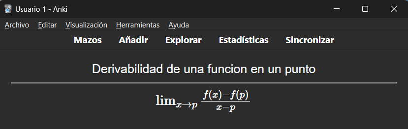

  Interfaz de la aplicacion ANKI

**Ejecucion del codigo**
---
Ya que el codigo cuenta con un archivo MakeFile, ya se tiene implementado la manera en la que se debe compilar el codigo, solo se debe iniciar (Run) y disfrutar.

**Funcionalidad del programa**
---
El programa trabaja a traves de dos menus principales:
- Menu de sesion: Se encarga de que el usuario tenga la opcion de iniciar sesion, creandose una cuenta, o bien, si solo quiere probar el programa, entrar como invitado, para utilizar las funcionalidades sin la obligacion de crear una cuenta. Su complejidad temporal es O(1) en insercion al crear cuenta, y O(n) para verificar si la cuenta existe o al iniciar sesion para ver si existe la cuenta
- Menu de usuario: Este es el menu esencial para el funcionamiento del programa, que contiene todas las opciones de manipulacion de tarjetas como las de cerrar sesion o el programa como tal, las cuales son las siguientes:
  - Crear tarjeta: Crea una card y la ingresa en la lista. Complejidad temporal: O(1) mejor caso, O(n) peor caso.
  - Visualizar tarjetas : Muestra todas las preguntas ingresadas por el usuario. Complejidad temporal: O(n).
  - Mostrar tarjetas: Muestra las tarjetas ordenadas por dificultad o por categoria, que son parametros asignadas por el usuario. Complejidad temporal: O(n) ya que se muestran todas las preguntas.
  - Modificar tarjetas: Modifica cualquiera de los parametros de las preguntas ingresadas en la lista, que consigue la libertad de modificar las preguntas como el usuario prefiera. Complejidad temporal: O(n).
  - Cerrar sesion: Cierra la sesion y vuelve al menu de sesion sin necesidad de cerrar el menu. Complejidad: O(1).
  - Cerrar programa: Cierra el programa de forma segura. Complejidad temporal: O(1).

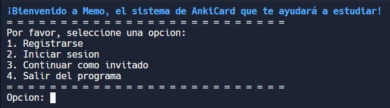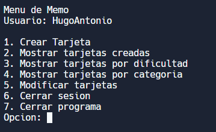

  Capturas de los menus del programa (sesion y usuario respectivamente)

**Fallos no corregidos del codigo**
--
El programa si bien, ocupandolo de forma correcta, se puede usar de forma muy intuitiva y eficiente, el codigo tiene sus fallos minusculos, los cuales se resumen en los siguientes:
- Debimos modificar la funcion presioneTeclaParaContinuar ya que habian veces donde se tenian que presionar dos veces, por lo que tuvimos que parchar la funcion, metiendo un if en todo lo que presente getChar para que funcione "bien".
- No presenta un filtro para detectar la entrada de una variable de tipo char, en una donde se pide una variable de tipo int y viceversa, la cual puede perjudicar en el funcionamiento correcto del codigo. Por favor, si utilizan el programa, si se pide un numero, ingresar numeros y no caracteres y viceversa, solo para el buen funcionamiento del codigo.
- Al igual que al crear un usuario, que sea un usuario sin espacios *(ej: UserName123, y no, UserName 123)* ya que puede generar problemas al seguir con el procedimiento de creacion de cuenta.
- Evitar el uso de comas al momento de ingresar las preguntas o respuestas o categorias (cualquiera que contenga caracteres), ya que como estos datos se almacenan en un archivo .csv (*en español, valores separados por comas*), puede provocar fallas al momento de leer cuando se carguen las preguntas del usuario, con llevando a fallas en el funcionamiento de los tdas al momento de ingresar las cartas.

**Uso del programa**
--
En las siguientes capturas, se mostraran ejemplos del uso correcto del programa.

### Crear cuenta

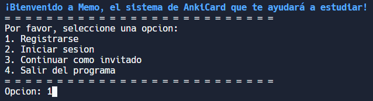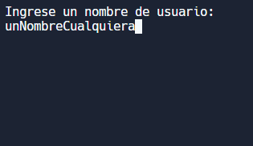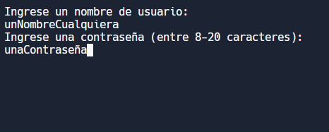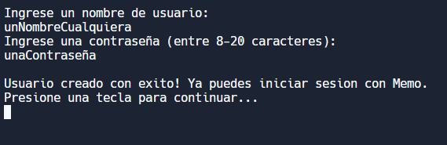

  Se muestra el funcionamiento de crear una cuenta

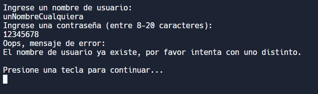

  Si la cuenta existe, muestra un mensaje de error

### Crear tarjetas, y sus metodos de estudio
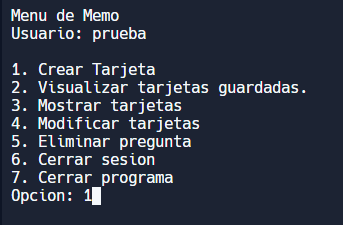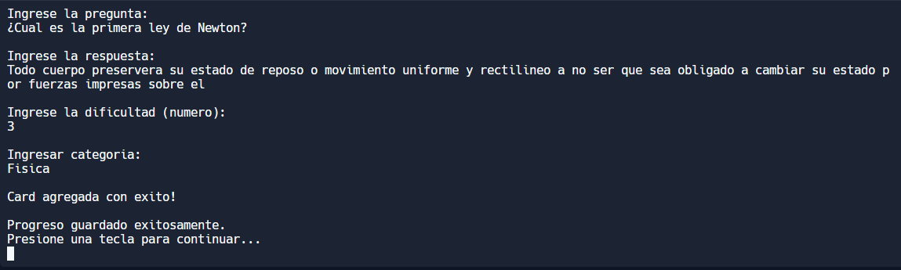

  Funcionamiento de como ingresar una pregunta

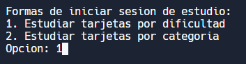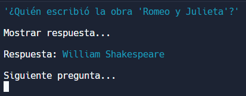

  Metodo de estudio por dificultad y formato de las preguntas

**Contribuciones en el proyecto**
--
### Daniela Vallejos:
- Secciones del informe
  - Introduccion
  - Descripcion de la solucion
  - Conclusion
- Codigo
  - Implementacion de las opciones esenciales del menu de usuario (crear tarjeta, visualizar tarjetas, mostrar tarjetas) incluyendo las funciones que hacen trabajar las opciones, asi como implementacion de los TDAs, y los structs usados por el programa.

### Hugo Gonzalez:
- Secciones del informe
  - Dominio del problema
  - Descripcion de la aplicacion
  - Planificacion
- Codigo
  - Implementacion de los menu (funcionamiento, interfaz, funcionamiento de los bucles que imitan inicios de sesion) opciones de inicio de sesion (incluyendo sus funciones), y opcion de modificar preguntas del menu de usuario, y el funcionamiento de guardar los datos a traves de csv, incluyendo las funciones que manipulan y modifican estos mismos.
- Diseño y redaccion del README